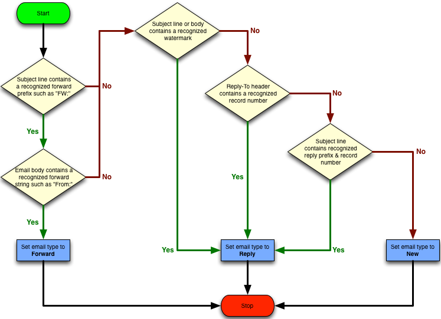

# ServiceNow Inbound Email Actions

## Inbound email actions enable you to define the actions an instance takes when receiving email.

Inbound email actions are similar to business rules: both use conditions and scripts that take action on a target table. An inbound email action checks the email for a watermark that associates it with a task and checks for other conditions. If the conditions are met, the system takes the inbound email action that you configure. The system can take two types of actions:
Record action: setting a value for a field in the target table.
Email reply: sending an email back to the source that triggered the action.
By default, if an email has no identifiable watermark, an inbound email action attempts to create an incident from the message. If the email has a watermark of an existing incident, an inbound email action updates the existing incident according to the action's script.

## Inbound email action types

|Order|	Type	| Criteria|
|---|---|---|
|1	|Forward | 	The system classifies an email as a forward only when it meets all these criteria:The subject line contains a recognized forward prefix such as FW:.The email body contains a recognized forward string such as From:.The system classifies any email that meets these criteria as a forward, even if the message contains a watermark or record number that otherwise classifies it as a reply.|
|2	|Reply	|The system classifies an email as a reply when it fails to match it to the forward inbound action type and it meets any one of these criteria:The subject line or email body contains a recognized watermark such as Ref:MSG0000008.There is no watermark and the Reply-To header contains a recognized record number such as INC0005574.There is no watermark and the subject line contains a recognized reply prefix such as RE: and a recognized record number such as INC0005574|
|3	|New	|The system classifies an email as new when it fails to match it to the forward and reply inbound action types.|
