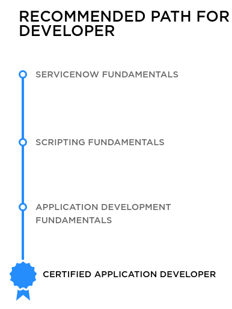
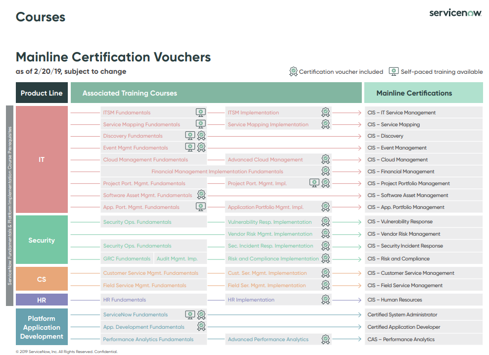
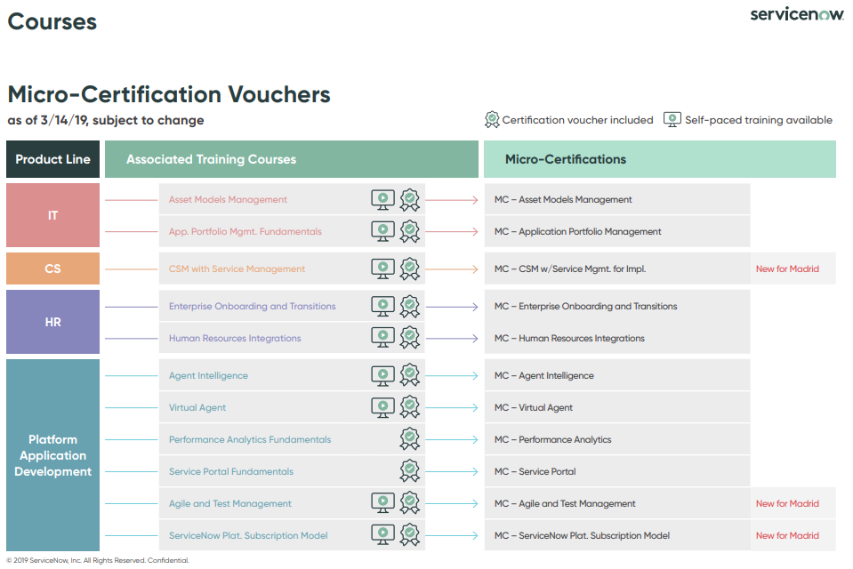

# ServiceNow Developer Role:

## PRIMARY RESPONSIBILITIES

- Utilizing technical expertise; Creates system requirements, performs design and analysis, and coding and unit testing of complex to highly complex system functionality and/or defect correction across multiple platforms.
- Identifies ideas to improve system performance and impact availability.
- Resolves complex technical design issues.
- Provides functional and/or technical guidance in evaluating applications systems or evaluating requests for proposals.
- Coordinates changes and influences and prioritizes tasks with business or technical departments.
- Analyzes and influences technical, system, and/or user requirements.
- Identifies and creates solutions to improve system performance and availability.
- Facilitates root cause analysis of system issues to minimize impact and future occurrences.
- Creates system documentation/play book(s) and serves as a lead technical reviewer and contributor in requirements, design and code reviews.
- Typically serves as a resource to the business.
- Develops accurate estimates on work packages and ensures the accuracy of estimates developed by less experienced internal and third party team members.
- Analyzes and designs specifications for less experienced internal and third party team members to execute.
- Acts as a technical resource throughout the development life cycle.
- May also actively contribute to the technical and soft skills development of team members.
- Assists team leads and management with delegation of technical work packages to cross functional and third party team members for execution through the full development life cycle.

## MINIMUM REQUIREMENTS
- Bachelor's degree or 4 additional years of related experience beyond the minimum required in lieu of a degree.
- AND, 6 or more years of software development experience demonstrating depth of technical understanding within ITIL Processes, Configuration Management, or Software Development

## PREFERRED
- 5+ years ServiceNow experience administering the platform, monitoring performance, deploying applications, building out catalog items/workflows, and configuring integrations
- 5+ years experience writing and debugging JavaScript
- 5+ years experience writing and debugging Angular, HTML, and CSS
- 3+ years experience with REST API development
- ServiceNow Developer Certification
- Working knowledge how configuration management factors into the ITIL framework
- Previous working experience with ServiceNow CMDB
- Knowledge of relational database concepts
- Experience with ServiceNow Discovery
- Experience with IT Asset Management and ServiceNow Software Asset Management module

## ServiceNow Certified Application Developer
DURATION: 90 Minutes
$ 150

- Overview
Demand for ServiceNow experts is growing rapidly. ServiceNow certification gives attendees the knowledge and confidence to take full advantage of the ServiceNow platform. Throughout the training and certification programs, attendees learn to configure, customize and design with real-world examples and a hands-on approach.

ServiceNow Certification exams are computer-based, multiple-choice exams delivered by ServiceNow testing partner Kryterion, in a proctored environment. Online proctoring is also available.

- Prerequisites
To be successful on this exam, attendees should be experienced ServiceNow system administrators who have hands‑on experience administering and developing on a ServiceNow instance. ServiceNow also offers an Application Creation course to help prepare attendees to become successful application developers.
To prepare for the exam, please download the [exam blueprint](./snow-repo/ds-certified-application-developer.pdf) to review what will be covered.

